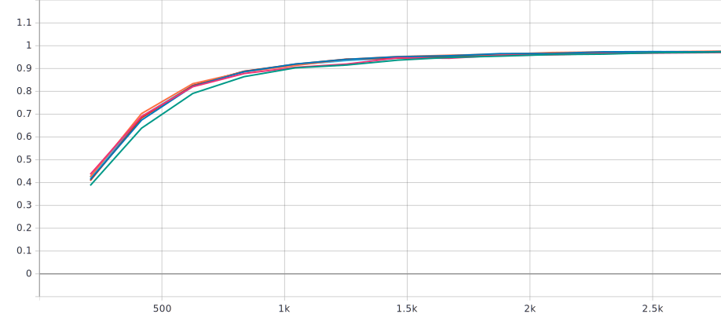

-- This is a project for my master's degree course, Learning from Images --

Participants: Me. Also, myself.

# LicensePlateReconstructor

This project aims to reconstruct readable and rectified license plates from pictures of
the [CCPD dataset](https://github.com/detectRecog/CCPD). The approach followed is basically a toy example, no good
results were expected.

While the idea originates from the [classic FBI/police series trope](https://knowyourmeme.com/memes/zoom-and-enhance),
the execution stems from academical interest. We take the Generator from a classic GAN setup (from now on called License
Plate Reconstructor, or LPR) and answer the question, "What if I used an Optical Character Recognizer (OCR) to evaluate
my Generator?"

## Outline

- [Setup](#setup)
- [Optical Character Recognizer](#optical-character-recognizer)
  - [Synthetic Plates Dataset](#synthetic-plates-dataset)
  - [OCR Architecture](#ocr-architecture)
  - [OCR Results](#ocr-results)
- [License Plate Reconstructor](#license-plate-reconstructor)
  - [Chinese License Plate Dataset](#chinese-license-plate-dataset)
  - [LPR Architecture](#lpr-architecture)
  - [LPR Results](#lpr-results)
- [Conclusion](#conclusion)

## Setup

The basic idea is to have our LPR produce clean- and straight-looking license plates from bent, rotated, tilted and
otherwise malformed license plate pictures, with the OCR evaluating the result. The loss for the LPR is then determined
by the loss of the OCR, as well as an optional "template" loss, which is meant to force the LPR to adhere to the basic
configuration of such a license plate.

## Optical Character Recognizer

The following section describes the complete process around the Optical Character Recognizer. We first summarize our
synthetic dataset, before explaining our architecture and the reasoning behind it.

### Synthetic Plates Dataset

Since there is no dataset of good-looking license plates, we synthetically generate our own. They only resemble license
plates in the most broad sense, in reality the generated images are clean-looking images with text.

Our LPR dataset will contain chinese license plates, so we have to satisfy some additional restraints:

- Chinese License Plates are potentially very colorful, as can be seen
  on [Wikipedia](https://en.wikipedia.org/wiki/Vehicle_registration_plates_of_China#Common_types). The dataset should
  therefore reflect a variety of color combinations.
- They also feature two-tone or gradient backgrounds, in addition to the general one-color variation.
- The official font is not known, we therefore use several comparable fonts for latin and chinese characters.
- To make it sensible to artifacts the LPR might generate, we introduce a "catch-all" group of several noise characters.
- To allow a smaller and faster network, we constrain the number of characters to 7-10.

*Some example images.*

We generate three data sets:

Dataset | Amount of Images | Amount of Characters
--- | ---: | ---:
Training | 500.000 | 3.750k
Val/Test | 50.000 | 375k

### OCR Architecture

*Image from the PP-OCR paper, which took it from "An End-to-End Trainable Neural Network for Image-based Sequence
Recognition and Its Application to Scene Text Recognition".*

The architecture for the OCR follows the CRNN as used
in [PP-OCR: A Practical Ultra Lightweight OCR System](https://arxiv.org/abs/2009.09941v3)
and [An End-to-End Trainable Neural Network for Image-based Sequence Recognition and Its Application to Scene Text Recognition](https://arxiv.org/abs/1507.05717)
.

To have both LPR and OCR in the same framework, we do not use Du et
al.'s [PaddlePaddle](https://github.com/PaddlePaddle/Paddle) implementation. As the CNN backbone originates
from [MobilenetV3](https://arxiv.org/abs/1905.02244), we
take [one of the many PyTorch implementations](https://github.com/d-li14/mobilenetv3.pytorch/blob/master/mobilenetv3.py)
and adjust it to match the PP-OCR architecture. To be precise, we removed the prediction head. Further, as our input
sizes are larger, we concatenate the vertical CNN representations to still have a single vertical slice.

The PP-OCR/Mobilenetv3 implementation was chosen, because, as it is meant to be used as a loss function, we want a
light-weight and small model. A model that is designed to be used on mobile devices is therefore perfect for our use
case.

With `width_mult` of 0.5 and everything else default, our model ends up at **464 K Trainable params**.

### OCR Results

Offtopic: At first we trained several models with broken dataloading, but, utilizing a lot of hyperparameter
optimization, still managed to push it to 80%. After fixing that error, training was substantially easier:

We first trained a model using the default parameters and the proposed learning rate from PyTorch Lightning's
auto_lr_find, 0.0027542. Since it didn't fully converge at that point, we continued training twice with the same
parameters.

For the longest-running model we report 97% accuracy on the validation set, which can be seen as equal to the test set,
as we did not perform hyperparameter optimization. Both models achieved 95%+ in just 4-5 epochs. This near-perfect score
was expected, since our dataset was deliberately manufactured to produce good-looking, easy readable images.

*Validation accuracy.*

*Training loss.*

## License Plate Reconstructor

In this section we will again first describe the dataset, then explain the architecture before reporting our results and
into a quantitative and qualitative error analysis of our two settings: with and without template loss.

### Chinese License Plate Dataset

The CCPD dataset contains over 300k images of chinese parking cars in varying weather and light conditions. Additional
features are location, rotation and content of the license plates, as well as a blurriness and a lighting score.

The dataset is split into multiple categories: *base, blur, challenge, db* (very **d**ark and **b**right pictures)*,
fn* (very **f**ar or **n**ear pictures)*, np* (**n**o **p**lates, with missing license plates)*, rotate, tilt, weather*.

The test dataset contains mostly harder categories, like blur and challenge, while train and validation contain images
of every category.

As our goal is to achieve human-readable license plates, we do not perform hyperparameter optimization with the goal of
achieving better quantitative results. Therefore, there is no data leaking between the train and validation set, and the
validation set can be seen as an easier test set. In the following, we will call the official validation set `easy`, and
the official test set `challenge`.

### LPR Architecture

*Generator part of the architecture image from the PI-REC paper.*

The generator's architecture follows [PI-REC](https://arxiv.org/abs/1903.10146), a U-NET variation with residual blocks.
As the [official implementation](https://github.com/youyuge34/PI-REC) works with our use-case out of the box, no
adjustments were made.

As mentioned in the [Setup](#setup) section, we introduce an auxiliary loss: the error between a "template" and the
generated image. Ideally, this template can be seen as the mean of all possible license plate combinations. We evaluate
4 different templates, as described in the next section. I did not yet find a paper that follows this approach.

Aside from different λ, we perform no hyperparameter option and chose the default values for nearly everything. The
resulting model has 5.8 M parameters, which results in 6.3 M parameters for the complete setup of OCR+LPR.

λ|Optimizer|Learning Rate|Precision|Batch Size|Residual Blocks|Rest
:---:|:---:|:---:|:---:|:---:|:---:|:---:
{0.2, 1, 5}|Adam|0.0001|16-bit|480|6|Default from PI-REC

**The chosen hyperparameters.**

### LPR Results

For evaluating the LPR, we run two settings: one without, and one with the template loss.

#### Without Template

We train multiple identical models to observe the effect of random initialization on the result.

**Quantitative Results are certainly good enough.** On the Easy dataset, accuracy hits over 90% in about 4 epochs and
97%+ after 10 (see Easy Accuracy Graph below). The Challenge dataset proves more difficult, but ends up at 70%+
depending on the training time. There is certainly room for improvement, but since this work focuses on replicating
good-looking license plates, this is fine for now.

Following are the results table as well as graphs that show the fast convergence of the training.

Model Number | Trained Epoch | Easy Accuracy | Challenge Accuracy
--- | :---: | :---: | :---:
V3 | 31 | 0.99 | 0.70
V1 | 39 | 0.99 | 0.72
V4 | 52 | 0.99 | **0.78**
V2 | 53 | 0.99 | 0.76
V5 | 53 | 0.99 | 0.76

*(Table ordered by training time)*

*Easy Accuracy.*

*Easy Loss (Logarithmic Scale).*

*Train Loss (Logarithmic Scale).*

The Loss varies within an epoch quite a lot, this is most likely due to the varying degree of difficulty within the data
sets.

Note: The short blue line displays a failed data loading version. This is mainly for people who have seen the project
presentation, but has no further meaning here.

**Qualitative Results are lacking.** While the OCR is near perfectly able to read most reconstructed license plates, it
is fairly hard for a human. Non-surprisingly, the results remind of visualization work
like ["The Building Blocks of Interpretability"](https://distill.pub/2018/building-blocks/).

**Human readability goes down as model performance goes up.** The longer we train, the more the LPR fine-tunes on the
specific requirements of the OCR, which not necessarily coincide with the requirements of a human. Most notably, the
lower parts of the numbers `9` and `2` disappear, and the general sharpness of each sign decreases.

*Exemplary images for three models at epoch 1, 3 and 10, in that order.*

#### With Template

The template's goal is to force the LPR to generate images that follow the general configuration of a license plate. To
this end, we evaluate 4 different templates:

- **Blank**. This template shows a border around a blue, empty surface and serves a baseline.
- **Squares**. This template shows additionally completely white squares in the places the normal license plate would
  have characters, in combination with a white dot in place of the white dot in the original plates. The reasoning
  being, that the LPR would choose white to represent the characters, as that is closer to the template.
- **Transparency**. Following the same approach as `Squares`, but with 50% alpha value. This is to alleviate the loss
  for the area surrounding the characters, while still nudging the characters to be white. As the white dot is already
  its target, it remains unchanged.
- **Grid**. Instead of even squares, we alternate between white and blue pixels. This follows the same reasoning as
  Transparency with a different approach.

The templates can be seen further below in the qualitative evaluation.

For quantitative evaluation, we note 3 things:

- **OCR loss behaves identically for every template and Lambda.** The template loss seemingly does not contradict the
  OCR loss.
- **Higher Lambda leads to a higher loss floor.** This was expected, as a perfectly replicated license plate would not
  satisfy the template loss completely.
- **Accuracy improves marginally slower, but still ends up at a near-perfect score.**

*Total loss during training (Logarithmic Scale).*

*Template loss during training (Logarithmic Scale).*

*OCR loss during training (Logarithmic Scale).*

*Easy Accuracy during training.*

*Exemplary images for the proposed templates at epoch 1, 3 and 10, in that order.*

We additionally try each with different lambda, specifically 0.2, 1 or 5. We show a comparison of each different lambda
on the basis of the transparency template.

*Different lambdas used with the Transparency template, again for epochs 1, 3 and 10.*

We observe:

- **Higher lambdas lead to the same result but faster** at barely any impact on performance.
- **The templates are an efficient way of adjusting background color.** However, they were not able to adjust the color
  choice for the characters.
- **Most surprisingly, the dot was ignored completely.** We assumed, the white, constant dot would be the simplest
  option for the model to adhere to both losses. However, even with a lambda of 5, the dot was barely noticeable.

## Conclusion

While this approach was never meant to produce meaningful results, we can still draw some conclusions and learnings from
it:

**The OCR was unfit to evaluate the LPR within the proclaimed goal.** However, this project serves as a reminder as to
what makes Generative Adversarial Networks so strong: In this setup, the fixed OCR never adjusted its own flaws to
better represent the original images. The LPR was therefore able to identify and abuse those flaws, even more so as
training time went on. A Discriminator would have identified its own flaws and learned to improve on them.

**The LPR was able to produce images that satisfy the OCR's requirements.** While the resulting images were hard to read
for humans, the LPR was quick to identify the requirements of the OCR and produce images that were perfectly readable by
the OCR.

**The setup was able to precisely read the license plates in just a few epochs.** As the CCPD dataset contains some
barely readable license plates, having a working configuration which can predict the contents of those license plates
with so few parameters and training, is a surprisingly good result. Sadly,
the [CCPD repository](https://github.com/detectRecog/CCPD) does not report singular results for text recognition, but
only license plate detection and text recognition combined. However, as we have the combined score and the detection
score, we can estimate the precision of the reported Holistic-CNN to be 49%, while our method consistently achieved
70-80% accuracy while never optimizing for performance. Sadly, we cannot report FPS to have a meaningful comparison.
